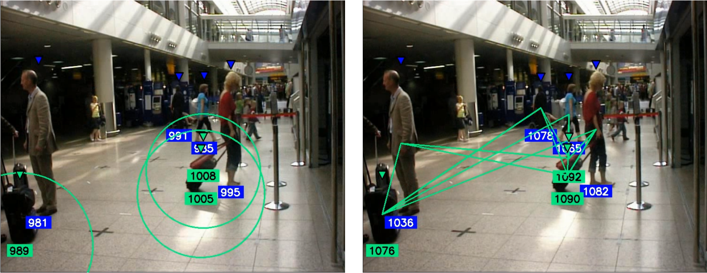

# Search for the optimal flight route for a drone based on the analysis of aerial photos
[

The repo considers the use of two detectors of the YOLO family and several trackers.
After you search for objects in the frame and give them an id, you search for objects that are in close proximity to the person and can't be left behind. There are several methods for searching for such items, but the two most interesting ones should be described separately. First, at least one pixel of a person is located in a circle built around the middle of the lower edge of the bounding box, the radius of which depends on the width of the object. The second is the Euclidean distance between the centers of the bounding boxes of a person and an object that is less than the specified value, depending on the width of the object multiplied by a factor. Items that do not pass the inspection are considered suspicious and are calculated individually for each frame.

Visualization of search methods:

Suspicious items are passed for filtering and identifying abandoned objects, along with information about previously detected objects. For each of the items in the current frame, a comparison is made with those previously detected using the intersection over union metric. If it turns out to be more than 60% for a pair of objects, then we assume that they are the same object. If there is no previously detected item for the item in the current frame, such that their intersection over union is more than the specified value, then the object is considered to have been discovered for the first time. For items that are detected on 40% of the frames from the specified value, the status of the abandoned item is assigned, while for the remaining items, the status of suspicious remains. Items that have not appeared for more than the specified amount of time are deleted from memory.
The described filtering function increases the resistance to random appearances of a person near the left item. If you make an assessment without it, the left item (red marker) may become ordinal (green marker)

On the left is an algorithm without a filtering function, on the right is an algorithm with a filtering function:

## YOLOv5 results
MOT metrics: 
|   Tracker  |  IDF1 |  MOTA |  MOTP |
|:----------:|:-----:|:-----:|:-----:|
|  ByteTrack | 0,812 | 0,858 | 0,036 |
|    SORT    | 0,358 | 0,583 | 0,036 |
| StrongSORT | 0,791 | 0,857 | 0,036 |

First algorithm: 
|   Tracker  | ACCURACY | PRECISION | RECALL |
|:----------:|:--------:|:---------:|:------:|
|  ByteTrack |   0,900  |   0,966   |  0,316 |
|    SORT    |   0,900  |   0,966   |  0,316 |
| StrongSORT |   0,900  |   0,966   |  0,316 |

Second algorithm:
|   Tracker  | ACCURACY | PRECISION | RECALL |
|:----------:|:--------:|:---------:|:------:|
|  ByteTrack |   0,920  |   0,850   |  0,380 |
|    SORT    |   0,920  |   0,850   |  0,380 |
| StrongSORT |   0,920  |   0,850   |  0,380 |

## YOLOv8 results
MOT metrics: 
|   Tracker  |  IDF1 |  MOTA |  MOTP |
|:----------:|:-----:|:-----:|:-----:|
|  ByteTrack | 0,805 | 0,853 | 0,044 |
|    SORT    | 0,394 | 0,584 | 0,044 |
| StrongSORT | 0,823 | 0,857 | 0,044 |

First algorithm: 
|   Tracker  | ACCURACY | PRECISION | RECALL |
|:----------:|:--------:|:---------:|:------:|
|  ByteTrack |   0,906  |   0,948   |  0,326 |
|    SORT    |   0,906  |   0,948   |  0,326 |
| StrongSORT |   0,918  |   0,948   |  0,402 |

Second algorithm:
|   Tracker  | ACCURACY | PRECISION | RECALL |
|:----------:|:--------:|:---------:|:------:|
|  ByteTrack |   0,906  |   0,948   |  0,326 |
|    SORT    |   0,906  |   0,948   |  0,326 |
| StrongSORT |   0,918  |   0,948   |  0,402 |
